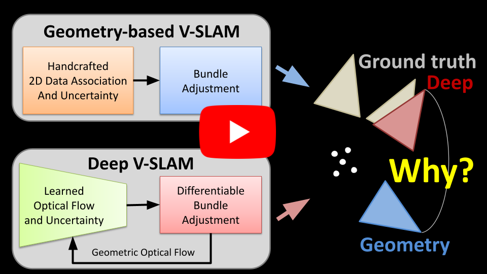

# Why does Deep Learning Improve Visual SLAM?

[](https://www.youtube.com/watch?v=EiuZ7MT0iVc)

This repo contains a version of [ORB-SLAM3](https://github.com/UZ-SLAMLab/ORB_SLAM3/tree/master) that uses learned optical flow and uncertainty from [DROID-SLAM](https://github.com/princeton-vl/droid-slam) for 2D data association instead of ORB descriptor matching.
This code is used in our publication: **Why does Deep Learning Improve Visual SLAM?**

## Publication
If you use this code in an academic context, please cite the following [Preprint](https://arxiv.org/pdf/2607.06023).

G. Cioffi and D. Scaramuzza, "**Why does Deep Learning Improve Visual SLAM?**," Arxiv 2026 (Under review).

```
@article{cioffi2026whydeep,
  title={Why does Deep Learning Improve Visual SLAM?},
  author={Cioffi, Giovanni and Scaramuzza, Davide},
  journal={Arxiv},
  year={2026}
}
```

## Install

The code depends on [ORB-SLAM3](https://github.com/UZ-SLAMLab/ORB_SLAM3/tree/master) and [DROID-SLAM](https://github.com/princeton-vl/droid-slam). See the respective repositories for installation instructions.

In this repo, we provide an alternative installation using a Docker container for ORB-SLAM3. To build and launch the docker run:

```sh
docker build -t orbslam3 .

bash launch_container.sh
```

To install ORB-SLAM3, run

```sh
cd ORB_SLAM3

chmod +x build_dependencies.sh && ./build_dependencies.sh

mkdir build && cd build

cmake .. -DCMAKE_BUILD_TYPE=Release && make -j8
```

## How to run the code

Compute the optical flow and uncertainty weights from DROID-SLAM by using the script in *droidslam_utils/compute_opticalflow.py*. To run the script, place it in the main DROID-SLAM folder (the same as demo.py)

```sh
python compute_optical_flow.py --datapath=/datasets/TartanAirMono_grayscale/ --scene=ME000/img --calib=tartanair.txt --out_traj_prefix=/DROID_SLAM/opticalflow/ME000 --max_stepsize=5
```

To run ORB-SLAM3 with learned optical flow and uncertainty

```sh
./Examples/Monocular/mono_demo ./Vocabulary/ORBvoc.txt ./Examples/Monocular/TartanAir.yaml /datasets/TartanAirMono_grayscale/ME000/img ./Examples/Monocular/TartanAir_TimeStamps/ME000.txt stamped_traj_estimate /DROID_SLAM/opticalflow/ME000/ME000_opticalflow_maxstepsize_5.h5 0
```

The command above is an example on how to run the code on the ME000 sequence of the [TartanAir dataset](https://theairlab.org/tartanair-dataset/).

The script *droidslam_utils/tartanair_rgb_to_grayscale.py* provides an example on how to prepare the input data.

## Credits

The code in this repo is based on [ORB-SLAM3](https://github.com/UZ-SLAMLab/ORB_SLAM3/tree/master) and [DROID-SLAM](https://github.com/princeton-vl/droid-slam). Check their respective repositories for license and acknowledgments.